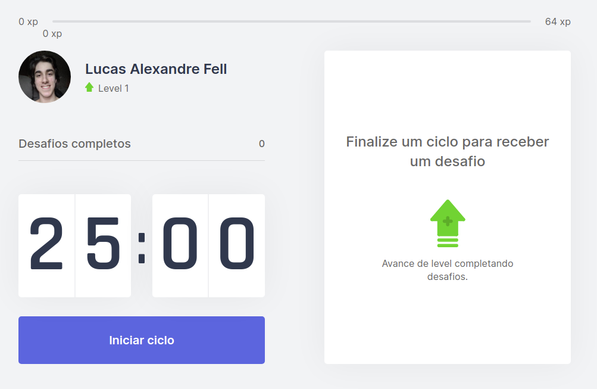

<!--
*** Thanks for checking out the Best-README-Template. If you have a suggestion
*** that would make this better, please fork the repo and create a pull request
*** or simply open an issue with the tag "enhancement".
*** Thanks again! Now go create something AMAZING! :D
***
***
***
*** To avoid retyping too much info. Do a search and replace for the following:
*** fell-lucas, nlw-moveit, twitter_handle, lucasafell@gmail.com, Move it, Move it is an application written during the event Next Level Week #4 by Rocketseat. This was a write-along project, and it is purely educational.
-->


<!-- PROJECT SHIELDS -->
<!--
*** I'm using markdown "reference style" links for readability.
*** Reference links are enclosed in brackets [ ] instead of parentheses ( ).
*** See the bottom of this document for the declaration of the reference variables
*** for contributors-url, forks-url, etc. This is an optional, concise syntax you may use.
*** https://www.markdownguide.org/basic-syntax/#reference-style-links
-->
[![Contributors][contributors-shield]][contributors-url]
[![Forks][forks-shield]][forks-url]
[![Stargazers][stars-shield]][stars-url]
[![Issues][issues-shield]][issues-url]
[![LinkedIn][linkedin-shield]][linkedin-url]


<!-- PROJECT LOGO -->
<br />
<p align="center">
  <a href="https://github.com/fell-lucas/nlw-moveit">
    
  </a>

  <h3 align="center">Move it</h3>

  <p align="center">
    Move it is an application written during the event Next Level Week #4 by Rocketseat. It started at the day 22/02/2021 and ended at 26/02/2021. This was a write-along project, and it is purely educational.
    <br />
    <br />
    <a href="https://moveit-sooty.vercel.app">View Demo</a>
  </p>
</p>


<!-- TABLE OF CONTENTS -->
<details open="open">
  <summary><h2 style="display: inline-block">Table of Contents</h2></summary>
  <ol>
    <li>
      <a href="#about-the-project">About The Project</a>
      <ul>
        <li><a href="#built-with">Built With</a></li>
      </ul>
    </li>
    <li>
      <a href="#getting-started">Getting Started</a>
      <ul>
        <li><a href="#prerequisites">Prerequisites</a></li>
        <li><a href="#installation">Installation</a></li>
      </ul>
    </li>
    <li><a href="#usage">Usage</a></li>
    <li><a href="#contact">Contact</a></li>
    <li><a href="#acknowledgements">Acknowledgements</a></li>
  </ol>
</details>


<!-- ABOUT THE PROJECT -->
## About The Project

<p align="center">
  <a href="https://moveit-sooty.vercel.app">
    
  </a>
</p>

### Built With

* [React Web](https://reactjs.org/)
* [Nextjs](https://nextjs.org/)
* [TypeScript](https://www.typescriptlang.org/)


<!-- GETTING STARTED -->
## Getting Started

To get a local copy up and running follow these simple steps.

### Prerequisites

* You must have Node.js installed on your machine.

### Installation

1. Clone the repo
   ```sh
   git clone https://github.com/fell-lucas/nlw-moveit.git
   ```
2. Install NPM packages
   ```sh
   npm install
   ```
2. Run local server
   ```sh
   npm run dev
   ```


<!-- USAGE EXAMPLES -->
## Usage

The application is very straightforward. Just click on "Start Cycle", and go do something else. When the timer runs out, you'll be notified and given a challenge to complete. The challenges are simple exercises to stretch your body and relax your eyes. If you completed what you had to do, you'll gain exp and eventually level up. If not, the timer just resets and you get to wait more 25 minutes.

## Contact

Lucas Alexandre Fell - [@lucas-fell](https://www.linkedin.com/in/lucas-fell/) - lucasafell@gmail.com

Project Link: [https://github.com/fell-lucas/nlw-moveit](https://github.com/fell-lucas/nlw-moveit)

<!-- ACKNOWLEDGEMENTS -->
## Acknowledgements

* [Rocketseat](https://rocketseat.com.br)
* [Diego Fernandes](https://www.linkedin.com/in/diego-schell-fernandes/)

<!-- MARKDOWN LINKS & IMAGES -->
<!-- https://www.markdownguide.org/basic-syntax/#reference-style-links -->
[contributors-shield]: https://img.shields.io/github/contributors/fell-lucas/nlw-moveit.svg?style=for-the-badge
[contributors-url]: https://github.com/fell-lucas/nlw-moveit/graphs/contributors
[forks-shield]: https://img.shields.io/github/forks/fell-lucas/nlw-moveit.svg?style=for-the-badge
[forks-url]: https://github.com/fell-lucas/nlw-moveit/network/members
[stars-shield]: https://img.shields.io/github/stars/fell-lucas/nlw-moveit.svg?style=for-the-badge
[stars-url]: https://github.com/fell-lucas/nlw-moveit/stargazers
[issues-shield]: https://img.shields.io/github/issues/fell-lucas/nlw-moveit.svg?style=for-the-badge
[issues-url]: https://github.com/fell-lucas/nlw-moveit/issues
[linkedin-shield]: https://img.shields.io/badge/-LinkedIn-black.svg?style=for-the-badge&logo=linkedin&colorB=555
[linkedin-url]: https://linkedin.com/in/fell-lucas
[product-screenshot]: readme/screenshot.png
